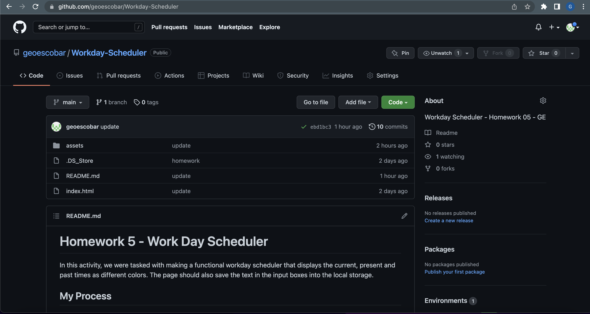
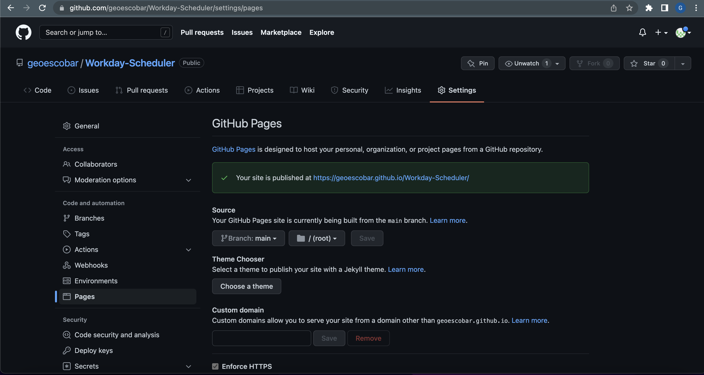

# Homework 5 - Work Day Scheduler 

In this activity, we were tasked with making a functional workday scheduler that displays the current, present and past times as different colors. The page should also save the text in the input boxes into the local storage. 

## My Process

* After mapping out a gameplan I went ahead and dove in by following the following steps! 

* Step 1: Link the current date into the header by using the requested format. I used moment.js to find the correct formatting for the output. 

* Step 2: I created a for loop for the hours of 9am-5pm. Then I created if/else statements to link the corresponding CSS styling id's. This for loop is what would allow the change of colors in the text input areas as the time changes. 

* Step 3: We move on to appending the divs to create the columns/rows. I also used moment.js to input the time the homework is asking us to use. 

* Step 4: Since the div's that were used to create the layout were made within js the save icons weren't functioning. I made event listeners that upon being clicked would save the text in the input box. By hitting save it will also add it to the local storage. 

* Step 5: Speaking of local storage. The final step was adding the information to local storage. This is what allows you to come back to the scheduler and still see the text you previously added or deleted. 

## GitHub Screenshots  

* Screenshot of my GitHub repo for the project:

* Screenshot of my GitHub pages for the project:

* Screenshot of the working project: 

